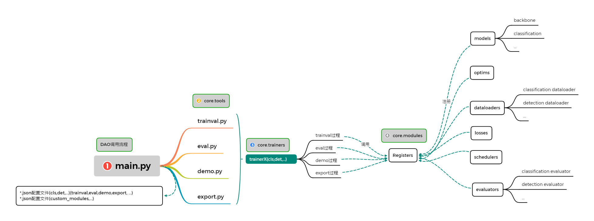

# FelixFu的项目集合

## 1. 项目由来

在**工业流程**中，深度学习应用过程包括：

- TrainVal(针对特定场景，特定数据集训练一个模型)
- Eval(使用验证/测试集测试，得到工业上的性能指标)
- Demo(将模型做个demo给客户展示)
- Export(将模型转成其他格式)
- Deploy(将模型部署到具体的设备上，并权衡速度与准确率)
- APP(将整个工业流程封装成带界面的APP)

在**深度学习训练**中，训练过程包括：

- 组件
  - dataloaders(数据加载)
  - models(模型：分类、分割、检测、异常检测等[Task](https://paperswithcode.com/sota))
  - losses(损失函数)
  - optims(优化器)
  - schedulers(学习率调整策略)
  - evaluator(训练过程中的性能评价)

- 联系（将上述组件联系起来）
  - trainers(训练过程)
    - resume
    - fune turning
    - 日志监控(训练过程日志输出，tensorboard，...)
    - 权重输出
    - multigpus(是否使用多GPU形式训练)
    - mixedprecisions(是否使用混合精度进行训练)
    - ......

目前，我所遇到的深度学习项目基本都能用这两个维度概括，为了方便以后使用，在此将两个维度整理成这个项目，将**工业流程（train、eval、demo、export、deploy的调用API）**封装到core.tools库中，将**深度学习训练(train & eval核心过程)**封装到core中。

## 2. 目录结构

### 2.1 组件支持

包括Model、Dataset、Dataloader、Loss、Evaluator、Optim、Scheduler等，详细请看[API](resources/API.md)。


### 2.2 项目结构

```tree
├── configs # ----------- 配置文件 ---------------
  |-- AnomalyDetection  # 异常检测配置目录
  |   |-- anomaly-PaDiM-MVTecDataset-demo-linux.json
  |   |-- anomaly-PaDiM-MVTecDataset-eval-linux.json
  |   |-- anomaly-PaDiM-MVTecDataset-export-linux.json
  |   `-- anomaly-PaDiM-MVTecDataset-trainval-linux.json
  |-- ImageClassification # 分类配置目录
  |   |-- cls-TIMMC(efficientnet_b0)-ClsDataset(LvJian)-ClsEvaluator-eval-linux.json
  |   |-- cls-TIMMC(efficientnet_b0)-demo-linux.json
  |   |-- cls-TIMMC(efficientnet_b0)-export-linux.json
  |   |-- cls-TIMMC(efficientnet_b0)-sgd_warmup_bias_bn_weight-ClsDataset(LvJian)-CrossEntropyLoss-warm_cos_lr-ClsEvaluator-trainval-linux.json
  |-- Modules # 其他模块配置，eg. 自定义模块配置文件
  |   |-- custom_modules.json
  |-- ObjectDetection
  |   |-- ......
  `-- ......

├── core # ----------- 核心库文件 ---------------
  |-- __init__.py 
  |-- DAO.py  # 接口文件
  |-- version.py  # 版本信息
  |-- modules # 模块组件
  |   |-- __init__.py   # 所有模块组件注册、导入
  |   |-- register.py   # 所有模块组件注册器
  
  |   |-- dataloaders   # dataloader组件
  |   |   |-- __init__.py
  |   |   |-- augments        # 数据增强库（albumentations版本）
  |   |   |-- augmentsTorch   # 数据增强库（Torch版本）
  |   |   |-- datasets        # 数据集库(ClsDataset, DetDataset, MVTecDataset, SegDataset)
  |   |   |-- utils           # 数据集读取库(data_prefetcher、samplers、dataloading)
  |   |   |-- AnomalyDataloader.py  # 异常检测数据读取文件
  |   |   |-- ClsDataloader.py      # 分类数据读取文件
  |   |   |-- DetDataloader.py      # 目标检测数据读取文件
  |   |   |-- SegDataloader.py      # 分割数据读取文件

  |   |-- evaluators   # evaluator组件
  |   |   |-- __init__.py
  |   |   |-- AnomalyEvaluator.py   # 异常检测测试文件
  |   |   |-- ClsEvaluator.py       # 分类测试文件
  |   |   |-- DetEvaluator.py       # 目标检测测试文件
  |   |   |-- SegEvaluator.py       # 分割测试文件
  
  |   |-- losses      # loss组件
  |   |   |-- __init__.py
  |   |   |-- CrossEntropyLoss.py   # 交叉熵
  |   |   `-- ssim.py               # TODO
  
  |   |-- models      # model组件
  |   |   |-- __init__.py
  |   |   |-- anomaly       # 异常检测库
  |   |   |-- backbone      # 主干网络库
  |   |   |-- cls           # 分类网络库
  |   |   |-- det           # 目标检测库
  |   |   |-- seg           # 分割库
  |   |   `-- utils         # 工具库

  |   |-- optims      # 优化器组件
  |   |   |-- __init__.py
  |   |   `-- sgd_warmup_bias_bn_weight.py
  
  |   |-- schedulers  # 学习率调整策略组件
  |   |   |-- __init__.py
  |   |   |-- cos_lr.py
  |   |   |-- multistep_lr.py
  |   |   |-- poly.py
  |   |   |-- warm_cos_lr.py
  |   |   |-- yolox_semi_warm_cos_lr.py
  |   |   `-- yolox_warm_cos.py
  
  |   `-- utils     # 各个组件所需的工具
  |       |-- __init__.py
  |       |-- boxes.py
  |       |-- helpers.py
  |       |-- metricCls.py
  |       |-- metricDet.py
  |       |-- metricSeg.py
  |       |-- model_utils.py
  |       `-- visualize.py

  |-- tools   # 训练工具库（trainval、eval、demo、export等）
  |   |-- __init__.py
  |   |-- demo.py
  |   |-- eval.py
  |   |-- export.py
  |   |-- trainval.py
  |   `-- utils   # 使用modules组件工具
  |       |-- __init__.py
  |       `-- register_modules.py
  
  |-- trainers  # Trainers工具库
  |   |-- __init__.py
  |   |-- launch.py
  |   |-- trainerAnomaly.py
  |   |-- trainerCls.py
  |   |-- trainerDet.py
  |   |-- trainerIQA.py
  |   |-- trainerSeg.py
  |   `-- utils # trainer过程所需的库
  |       |-- __init__.py
  |       |-- checkpoint.py
  |       |-- ema.py
  |       |-- logger.py
  |       |-- metrics.py
  |       `-- palette.py
  
  |-- utils   # 多GPU工具库
  |   |-- __init__.py
  |   |-- allreduce_norm.py
  |   |-- dist.py
  |   `-- setup_env.py

├── custom_modules # ----------- 自定义组件 ---------------
  |-- __init__.py 
  |-- model_mine.py
  `-- model_mine2.py

├── pretrained # ----------- 各个模型的预训练结果 ---------------
  |-- cls 
  |-- seg
  |-- det
  |-- anomaly
  
├── resources # ----------- 资源文档文件夹 ---------------
  
├── saved # ----------- 结果存放位置 ---------------
  |-- cls 
  |-- seg
  |-- det
  |-- anomaly
 
├── .gitignore
├── LICENSE
├── README.md
├── README.rst
├── requirements.txt
├── setup.cfg
├── setup.py

```
### 2.3 调用流程



#### 2.3.1 TrainVal过程

```
|- trainerX
|	|- before_train(train之前的操作，eg. dataloader,model,optim,... setting)
|	|	|- 1.logger setting：日志路径，tensorboard日志路径，日志重定向等
|	|	|- 2.model setting：获取模型
|	|	|- 3.optimizer setting：获取优化器，不同权重层，优化器参数不同的设置
|	|	|- 4.resume setting：resume，fune turning等设置
|	|	|- 5.dataloader setting：数据集dataset定义-->Transformer(数据增强）-->Dataloader（数据加载)--> ...
|	|   |- 6.loss setting: 损失函数选择，有的实验可以略掉，因为在model中定义了
|	|   |- 7.scheduler setting：学习率调整策略选择
|	|   |- 8.other setting: 补充2model setting，EMA，DDP模型等设置
|	|   |- 9.evaluator setting：验证器设置，包括读取验证集，计算评价指标等
|	|- train_in_epoch(训练一个epoch的操作)
|	|	|- before_epoch(一个epoch之前的操作)
|	|	|	|- 判断此次epoch使用进行马赛克增强；
|	|	|	|- 修改此次epoch的损失函数；
|	|	|	|- 修改此次epoch的日志信息格式;
|	|	|	|- ...
|	|	|- train_in_iter(训练一次iter的操作，一次完整的forward&backwards)
|	|	|	|- before_iter(一次iter之前的操作)
|	|	|	|	|- nothing todo
|	|	|	|- train_one_iter(一次iter的操作)
|	|	|	|	|- 1.记录data time和iter time
|	|	|	|	|- 2.(预)读取数据
|	|	|	|	|- 3.forward
|	|	|	|	|- 4.计算loss
|	|	|	|	|- 5.backwards
|	|	|	|	|- 6.optimizer 更新网络权重
|	|	|	|	|- 7.是否进行EMA操作
|	|	|	|	|- 8.lr_scheduler修改学习率
|	|	|	|	|- 9.记录日志信息(datatime,itertime,各种loss,...)
|	|	|	|- after_iter(一次iter之后的操作)
|	|	|	|	|- 1.打印一个iter的日志信息(epoch,iter,losses,gpu mem,lr,eta,...)
|	|	|	|	|- 2.是否进行图片的resize，即多尺度训练
|	|	|- after_epoch(一个epoch之后的操作)
|	|	|	|- 1.保存模型
|	|	|	|- 2.是否进行，evaluator
|	|- after_train(训练之后的操作)
|	|	|- 输出最优的结果
```

## 3. 如何使用
### 3.1  Train

`CUDA_VISIBLE_DEVICES=0,1,2,3 python tools/trainval/trainval.py -f configs/det_yolox_voc_default_sgd_yoloxwarmcos_trainval_ubuntu20.04.json -d 2 -b 64 --fp16 -o --cache`

> 备注：如果使用`CUDA_VISIBLE_DEVICES=4`， 最好将`-o`参数去掉

### 3.2 Eval

`CUDA_VISIBLE_DEVICES=0,1 python tools/eval/evalDet.py -f configs/det_yolox_voc_default_sgd_yoloxwarmcos_trainval_ubuntu20.04.json   -c  saved/det_yolox_voc_default_sgd_yoloxwarmcos_trainval_ubuntu20.04/voc/best_ckpt.pth -b 16 -d 1 --conf 0.001 --fp16 --fuse`

### 3.3 Demo

`CUDA_VISIBLE_DEVICES=0 python tools/demo/demoDet.py image -f configs/det_yolox_voc_default_sgd_yoloxwarmcos_trainval_ubuntu20.04.json   -c  saved/det_yolox_voc_default_sgd_yoloxwarmcos_trainval_ubuntu20.04/voc/best_ckpt.pth --path /root/code/AI/datasets/VOCdevkit/VOC2007/JPEGImages/ or dog.jpg --conf 0.2 --nms 0.5 --tsize 640 --save_result --device gpu`

### 3.4  Export

`CUDA_VISIBLE_DEVICES=0 python tools/export/export_onnx.py -f configs/det_yolox_voc_default_sgd_yoloxwarmcos_trainval_ubuntu20.04.json   -c  saved/pretrained/yolox_voc/11-14_08-45/best_ckpt.pth --output-name saved/pretrained/yolox_voc/11-14_08-45/best_ckpt.onnx`

### 3.5  Deploy
`TODO`


## Reference
### Segmentation 参考
- https://github.com/qubvel/segmentation_models.pytorch
- https://github.com/yassouali/pytorch-segmentation
  
### Detection 参考
- https://github.com/Megvii-BaseDetection/YOLOX
- https://zhuanlan.zhihu.com/p/391396921
- YOLOX课程: https://edu.51cto.com/center/course/lesson/index?id=774242
- FPN: https://cloud.tencent.com/developer/article/1546594
- PAFPN: https://zhuanlan.zhihu.com/p/397020975
- YOLOX结构图: https://blog.csdn.net/nan355655600/article/details/119329727

### 分布式参考
- DDP原理1: https://zhuanlan.zhihu.com/p/76638962 
- DDP原理2: https://zhuanlan.zhihu.com/p/343951042
- DDP随机种子: https://bbs.cvmart.net/articles/5491
