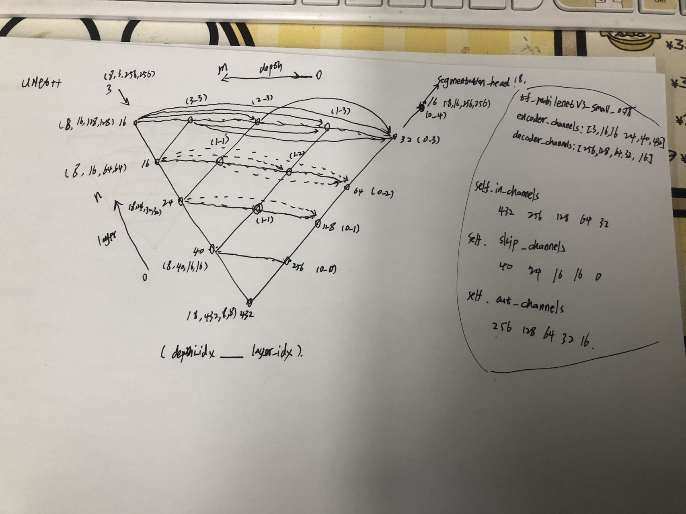
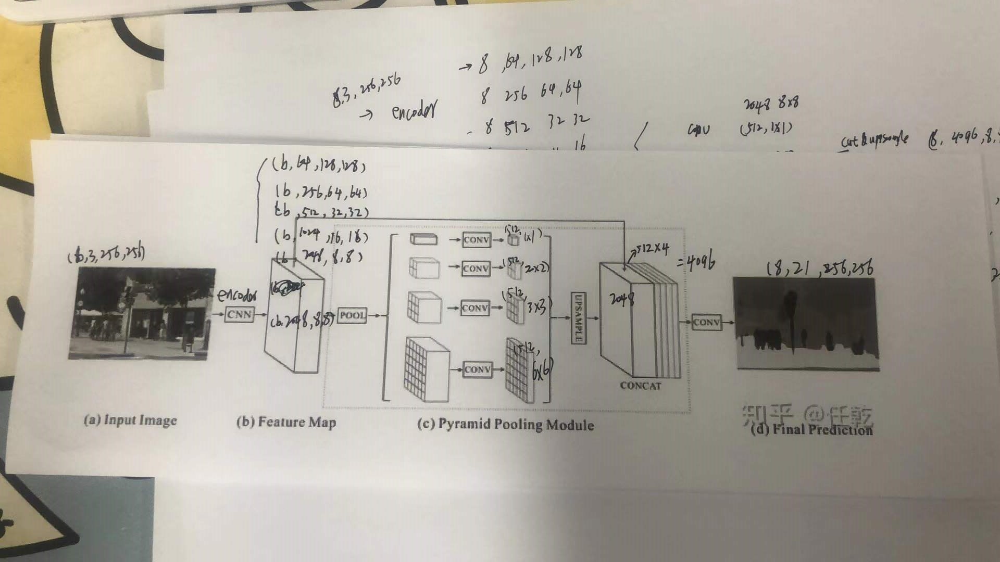

# API

## 1. datasets & dataloaders

### 🍳ClsDataset √

[source](../core/modules/dataloaders/datasets/ClsDataset.py)

**构造函数**

```
class ClsDataset(Dataset):
    def __init__(self,
                 data_dir=None,
                 image_set="",
                 in_channels=1,
                 input_size=(224, 224),
                 preproc=None,
                 cache=False,
                 separator=":",
                 images_suffix=None):
        """
        分类数据集

        data_dir:str  数据集文件夹路径，文件夹要求是
            |-dataset
                |- 类别1
                    |-图片
                |- 类别2
                |- ......
                |- train.txt
                |- val.txt
                |- test.txt
                |- labels.txt

        image_set:str "train.txt", "val.txt" or "test.txt"
        in_channels:int  输入图片的通道数，目前只支持1和3通道
        input_size:tuple 输入图片的HW
        preproc:albumentations.Compose 对图片进行预处理
        cache:bool 是否对图片进行内存缓存
        separator:str labels.txt, train.txt, val.txt, test.txt 的分割符（name与id）
        images_suffix:list[str] 可接受的图片后缀
        """
```

**configs**

```
"dataset": {
        "type": "ClsDataset",
        "kwargs": {
            "data_dir": "/root/data/DAO/screen",
            "image_set": "train.txt",
            "in_channels": 1,
            "input_size": [224, 224],
            "cache": True,
            "images_suffix": [".bmp"]
        },
        "transforms": {
            "kwargs": {
                "histogram": {"p": 1},
                "Normalize": {"mean": 0, "std": 1, "p": 1}
            }
        }
    }
```

### 🍛ClsDataloaderTrain √

[source](../core/modules/dataloaders/ClsDataloader.py)

**构造函数**

```
def ClsDataloaderTrain(
        is_distributed=False,
        batch_size=None,
        num_workers=None,
        dataset=None,
        seed=0,
        **kwargs):
    """
    ClsDataset的dataloader类

    is_distributed:bool 是否是分布式
    batch_size: int batchsize大小，多个GPU的batchsize总和
    num_workers:int 使用线程数
    dataset:ClsDataset类 数据集类的实例
    """
    
    ......
    return train_loader, max_iter
```

**configs**

```
 "dataloader": {
        "type": "ClsDataloaderTrain",
        "dataset": {
            "type": "ClsDataset",
            "kwargs": {
                "data_dir": "/root/data/DAO/screen",
                "image_set": "train.txt",
                "in_channels": 1,
                "input_size": [224, 224],
                "cache": True,
                "images_suffix": [".bmp"]
            },
            "transforms": {
                "kwargs": {
                    "histogram": {"p": 1},
                    "Normalize": {"mean": 0, "std": 1, "p": 1}
                }
            }
        },
        "kwargs": {
            "num_workers": 4,
            "batch_size": 256
        }
    },
```

### 🥩ClsDataloaderEval √

[source](../core/modules/dataloaders/ClsDataloader.py)

**构造函数**

```
def ClsDataloaderEval(
        is_distributed=False,
        batch_size=None,
        num_workers=None,
        dataset=None,
        **kwargs):
    """
    ClsDataset的dataloader类

    is_distributed:bool 是否是分布式
    batch_size: int batchsize大小，多个GPU的batchsize总和
    num_workers:int 使用线程数
    dataset:ClsDataset类 数据集类的实例
    """
    ......
    return val_loader, len(val_loader)
```

**configs**

```
"dataloader": {
    "type": "ClsDataloaderEval",
    "dataset": {
        "type": "ClsDataset",
        "kwargs": {
            "data_dir": "/root/data/DAO/screen",
            "image_set": "train.txt",
            "in_channels": 1,
            "input_size": [224, 224],
            "cache": True,
            "images_suffix": [".bmp"]
        },
        "transforms": {
            "kwargs": {
                "histogram": {"p": 1},
                "Normalize": {"mean": 0, "std": 1, "p": 1}
            }
        }
    },
    "kwargs": {
        "num_workers": 4,
        "batch_size": 256
    }
},
```

### 


### 🍟SegDataset

[source](../core/modules/dataloaders/datasets/SegDataset.py)

**构造函数**

```
Class SegDataset(data_dir=None, preproc=None, image_set="", in_channels=1, input_size=(224, 224), cache=False, image_suffix=".jpg", mask_suffix=".png"):
"""
	分割数据集

	data_dir:str  数据集文件夹路径，文件夹要求是
           |-dataset
                |- images
                    |-图片
                |- masks

    image_set:str "train.txt or val.txt or test.txt"
    in_channels:int  输入图片的通道数，目前只支持1和3通道
    input_size:tuple 输入图片的HW
    preproc:albumentations.Compose 对图片进行预处理
    cache:bool 是否对图片进行内存缓存
    images_suffix:str 可接受的图片后缀
    mask_suffix:str 可接受的图片后缀
"""
```

**config.json**

```
"dataset": {
	"type": "SegDataset",
	"kwargs": {
		"data_dir": "/root/data/DAO/VOC2012_Seg_Aug",
		"image_set": "val.txt",
        "in_channels": 3,
        "input_size": [380, 380],
        "cache": false,
        "image_suffix":".jpg",
        "mask_suffix":".png"
	},
    "transforms": {
    	"kwargs": {
    		"Resize": {"height": 224, "width": 224, "p": 1},
    		"Normalize": {"mean": [0.398993, 0.431193, 0.452234], "std": [0.285205, 0.273126, 0.276610], "p": 1}
		}
	}
}
```

### 🥗SegDataloaderTrain

[source](../core/modules/dataloaders/SegDataloader.py)

**构造函数**

```
def SegDataloaderTrain(is_distributed=False, batch_size=None, num_workers=None, dataset=None, seed=0)
"""
is_distributed : bool 是否是分布式
batch_size : int batchsize大小
num_workers : int 读取数据线程数
dataset : DotMap 数据集配置
seed : int 随机种子
"""
```

返回类型

```
train_loader = DataPrefetcherSeg(train_loader)
return train_loader, max_iter
```

**configs.json**

```
    "dataloader": {
        "type": "SegDataloaderTrain",
        "dataset": {
	        "type": "SegDataset",
            "kwargs": {
                    "data_dir": "/root/data/DAO/VOC2012_Seg_Aug",
                    "image_set": "val.txt",
                    "in_channels": 3,
                    "input_size": [380, 380],
                    "cache": false,
                    "image_suffix":".jpg",
                    "mask_suffix":".png"
	            },
            "transforms": {
                "kwargs": {
                    "Resize": {"height": 224, "width": 224, "p": 1},
                    "Normalize": {"mean": [0.398993, 0.431193, 0.452234], "std": [0.285205, 0.273126, 0.276610], "p": 1}
                }
            }
        },
        "kwargs": {
            "num_workers": 4,
            "batch_size": 32
        }
    }
```

### 🌭SegDataloaderEval

[source](../core/modules/dataloaders/SegDataloader.py)

**构造函数**

```
def SegDataloaderEval(is_distributed=False, batch_size=None, num_workers=None, dataset=None):
    """
    is_distributed : bool 是否是分布式
    batch_size : int batchsize大小
    num_workers : int 读取数据线程数
    dataset : DotMap 数据集配置
    """
```

返回类型

```
val_loader = torch.utils.data.DataLoader(valdataset, **dataloader_kwargs)
return val_loader, len(val_loader)
```


**configs.json**

```
"dataloader": {
            "type": "SegDataloaderEval",
            "dataset": {
                "type": "SegDataset",
                "kwargs": {
                    "data_dir": "/root/data/DAO/VOC2012_Seg_Aug",
                    "image_set": "val.txt",
                    "in_channels": 3,
                    "input_size": [380, 380],
                    "cache": false,
                    "image_suffix":".jpg",
                    "mask_suffix":".png"
                },
                "transforms": {
                    "kwargs": {
                        "Resize": {"height": 224, "width": 224, "p": 1},
                        "Normalize": {"mean": [0.398993, 0.431193, 0.452234], "std": [0.285205, 0.273126, 0.276610], "p": 1}

                    }
                }
            },
            "kwargs": {
                "num_workers": 4,
                "batch_size": 32
            }
        }
```

### MVTecDataset

```
MVTecDataset(
    data_dir=None,
    preproc=None,
    image_set="",
    in_channels=1,
    input_size=(224, 224),
    cache=False,
    image_suffix=".png",
    mask_suffix=".png",
    **kwargs
)
```

异常检测数据集，（MVTecDataset类型）

**1. 构造函数**

- data_dir:str  数据集文件夹路径，文件夹要求是
      📂datasets
      ┗ 📂your_custom_dataset
      ┣ 📂 ground_truth
      ┃ ┣ 📂 defective_type_1
      ┃ ┗ 📂 defective_type_2
      ┣ 📂 test
      ┃ ┣ 📂 defective_type_1
      ┃ ┣ 📂 defective_type_2
      ┃ ┗ 📂 good
      ┗ 📂 train
      ┃ ┗ 📂 good
- preproc:albumentations.Compose 对图片进行预处理
- image_set:str "train.txt or val.txt or test.txt"
- in_channels:int  输入图片的通道数，目前只支持1和3通道
- input_size:tuple 输入图片的HW
- cache:bool 是否对图片进行内存缓存
- image_suffix:str 可接受的图片后缀
- mask_suffix:str 可接受的图片后缀

## 2. models

### 🍕Backbones √

[Pytorch视觉模型库--timm](./models/timm_introduce.md) | [source](../core/modules/models/backbone/TIMM.py)

**构造函数**

```
def TIMM(backbone):
    """
    获取TIMM主干网络

    backbone:dict backbone:{kwargs:{这里面是timm库创建model的参数}}
    """
    # 判断model是否在timm支持列表中
    if backbone.kwargs.model_name not in timm.list_models():
        logger.error("timm {} not supported {}".format(
            timm.__version__,
            backbone.kwargs.model_name))
        raise

    # 判断model是否有pretrained
    if backbone.kwargs.pretrained and backbone.kwargs.model_name not in timm.list_models(pretrained=True):
        logger.error("{} hasn't pretrained weight, please set pretrained False".format(
            backbone.kwargs.model_name
        ))
        raise

    model = timm.create_model(**backbone.kwargs)
    return model

```


**configs.json**

```
"backbone": {
            "kwargs": {
                "model_name":"efficientnet_b0",
                "pretrained": true,
                "checkpoint_path": "",
                "exportable": true,
                "in_chans": 1,
                "num_classes": 38
            }
        }
```

需要嵌入其他网络中使用

### 🍿Classifications √

[source](../core/modules/models/cls/TIMMC.py)

**构造函数**

```
def TIMMC(backbone_kwargs):
    backbone = Registers.backbones.get("TIMM")(backbone_kwargs)
    return backbone
```

**configs.json**

```
"model": {
        "type": "TIMMC",
        "summary_size": [1,224,224],
        "backbone": {
            "kwargs": {
                "model_name":"efficientnet_b0",
                "pretrained": true,
                "checkpoint_path": "",
                "exportable": true,
                "in_chans": 1,
                "num_classes": 38
            }
        },
        "kwargs": {
        }
    }
```

### 🧂Unet

[source](../core/modules/models/seg/unet/model.py)

**构造函数**

```
class Unet( encoder,
            encoder_depth=5,
            encoder_channels=None,
            decoder_use_batchnorm: bool = True,
            decoder_channels: List[int] = (256, 128, 64, 32, 16),
            decoder_attention_type: Optional[str] = None,
            num_classes=2,
            activation: Optional[Union[str, callable]] = None,
            aux_params: Optional[dict] = None,
    )
"""
encoder: dict encoder的配置字典
encoder_depth: encoder深度
encoder_channels: encoder 的每一层channel数
decoder_use_batchnorm: bool
decoder_channels: List[int] = (256, 128, 64, 32, 16),
decoder_attention_type: Optional[str] = None,
num_classes=2,
activation: Optional[Union[str, callable]] = None,
aux_params: Optional[dict] = None,
"""
```

**configs.json**

```
"model": {
        "type": "Unet",
        "summary_size": [3,224,224],
        "backbone": {
            "kwargs": {
                "model_name": "resnet18",
                "pretrained": true,
                "checkpoint_path": "",
                "exportable": true,
                "in_chans": 3,
                "features_only": true
            }
        },
        "kwargs": {
            "encoder_depth": 5,
            "encoder_channels": [3, 64, 64, 128, 256, 512],
            "decoder_channels": [256, 128, 64, 32, 16],
            "num_classes": 21
        }
    }
```

### 🍦UNet++

[source](../core/modules/models/seg/unetplusplus/model.py) | [note](https://github.com/FelixFu520/README/blob/main/train/segmentation/unetpp.md)

**构造函数**

```
class UnetPlusPlus(SegmentationModel):
    def __init__(
        self,
        encoder,
        encoder_depth=5,
        encoder_channels=None,
        decoder_use_batchnorm: bool = True,
        decoder_channels: List[int] = (256, 128, 64, 32, 16),
        decoder_attention_type: Optional[str] = None,
        num_classes=2,
        activation: Optional[Union[str, callable]] = None,
        aux_params: Optional[dict] = None,
    ):
    
    encoder：CNN网络， 对应config中的backbone
    encoder_depth: CNN的深度，即encoder_channels的长度
    encoder_channels: CNN主干网络提取特征的通道数
    decoder_use_batchnorm: 构建decoder网络时是否使用BN
    decoder_channels：decoder时，输出的通道数
    num_classes: 类别数， VOC（20fg+1bg)所以VOC数据集时num_classes设为21
    activation: 构建decoder时，是否使用特定的激活函数
    aux_params: 构建UNethical++的额外参数
    
```

UnetPlusPlus通过`__init__`函数初始化，通过`forward`函数返回想要的值。

**config**

```
 "model": {
        "type": "UnetPlusPlus",
        "summary_size": [3,224,224],
        "backbone": {
            "kwargs": {
                "model_name": "tf_mobilenetv3_small_075",
                "pretrained": true,
                "checkpoint_path": "",
                "exportable": true,
                "in_chans": 3,
                "features_only": true
            }
        },
        "kwargs": {
            "encoder_depth": 5,
            "encoder_channels": [3, 16, 16, 24, 40, 432],
            "decoder_channels": [256, 128, 64, 32, 16],
            "num_classes": 21
        }
    }
```



### 🍺PSPNet

[source](../core/modules/models/seg/pspnet/model.py) | [note](https://github.com/FelixFu520/README/blob/main/train/segmentation/pspnet.md)

**构造函数**

```
class PSPNet(SegmentationModel):
    """PSPNet_ is a fully convolution neural network for image semantic segmentation. Consist of
    *encoder* and *Spatial Pyramid* (decoder). Spatial Pyramid build on top of encoder and does not
    use "fine-features" (features of high spatial resolution). PSPNet can be used for multiclass segmentation
    of high resolution images, however it is not good for detecting small objects and producing accurate, pixel-level mask.
    Args:
        encoder_name: Name of the classification model that will be used as an encoder (a.k.a backbone)
            to extract features of different spatial resolution
        encoder_depth: A number of stages used in encoder in range [3, 5]. Each stage generate features
            two times smaller in spatial dimensions than previous one (e.g. for depth 0 we will have features
            with shapes [(N, C, H, W),], for depth 1 - [(N, C, H, W), (N, C, H // 2, W // 2)] and so on).
            Default is 5
        encoder_weights: One of **None** (random initialization), **"imagenet"** (pre-training on ImageNet) and
            other pretrained weights (see table with available weights for each encoder_name)
        psp_out_channels: A number of filters in Spatial Pyramid
        psp_use_batchnorm: If **True**, BatchNorm2d layer between Conv2D and Activation layers
            is used. If **"inplace"** InplaceABN will be used, allows to decrease memory consumption.
            Available options are **True, False, "inplace"**
        psp_dropout: Spatial dropout rate in [0, 1) used in Spatial Pyramid
        in_channels: A number of input channels for the model, default is 3 (RGB images)
        classes: A number of classes for output mask (or you can think as a number of channels of output mask)
        activation: An activation function to apply after the final convolution layer.
            Available options are **"sigmoid"**, **"softmax"**, **"logsoftmax"**, **"tanh"**, **"identity"**, **callable** and **None**.
            Default is **None**
        upsampling: Final upsampling factor. Default is 8 to preserve input-output spatial shape identity
        aux_params: Dictionary with parameters of the auxiliary output (classification head). Auxiliary output is build
            on top of encoder if **aux_params** is not **None** (default). Supported params:
                - classes (int): A number of classes
                - pooling (str): One of "max", "avg". Default is "avg"
                - dropout (float): Dropout factor in [0, 1)
                - activation (str): An activation function to apply "sigmoid"/"softmax" (could be **None** to return logits)
    Returns:
        ``torch.nn.Module``: **PSPNet**
    .. _PSPNet:
        https://arxiv.org/abs/1612.01105
    """

    def __init__(
        self,
        encoder,
        encoder_channels=None,
        psp_out_channels: int = 512,
        psp_use_batchnorm: bool = True,
        psp_dropout: float = 0.2,
        num_classes: int = 1,
        activation: Optional[Union[str, callable]] = None,
        upsampling: int = 8,
        aux_params: Optional[dict] = None,
    ):
```

**configs**

```
"model": {
    "type": "PSPNet",
    "summary_size": [3,224,224],
    "backbone": {
        "kwargs": {
            "model_name": "resnet50",
            "pretrained": true,
            "checkpoint_path": "",
            "exportable": true,
            "in_chans": 3,
            "features_only": true
        }
    },
    "kwargs": {
        "encoder_channels": [3, 64, 256, 512, 1024, 2048],
        "psp_out_channels": 512,
        "num_classes": 21,
        "upsampling": 32
    }
},
```



### Deeplab

[source](../core/modules/models/seg/deeplab/model.py) | [note](https://github.com/FelixFu520/README/blob/main/train/segmentation/pspnet.md)

### Yolox

[source](../core/modules/models/seg/deeplab/model.py) | [note](https://github.com/FelixFu520/README/blob/main/train/segmentation/pspnet.md)

## 3. optims

### 🍔sgd_warmup_bias_bn_weight √

[source](../core/modules/optims/sgd_warmup_bias_bn_weight.py)

**构造函数**

```
def sgd_warmup_bias_bn_weight(model=None,
                              lr=0.01,
                              weight_decay=1e-4,
                              momentum=0.9,
                              warmup_lr=0,
                              warmup_epoch=5
                              ):
    """
    model:torch.nn.Module 此trainer的self.model属性
    lr: float 对于整个（多机多卡）batch size的学习率
    weight_decay:float torch.optim.SGD 默认参数
    momentum:float torch.optim.SGD 默认参数
    warmup_lr:float warmup时的学习率
    warmup_epoch:int warmup几个epoch
    """
```

**configs.json**

```
   "optimizer": {
        "type": "sgd_warmup_bias_bn_weight",
        "kwargs": {
            "lr": 0.01,
            "weight_decay": 1e-4,
            "momentum": 0.9,
            "warmup_lr": 0,
            "warmup_epoch": 5
        }
    }
```


- 

**2.configs.json**

## 4. losses

### 🍗CrossEntropyLoss √

[source](../core/modules/losses/CrossEntropyLoss.py)

**构造函数**

```
def CrossEntropyLoss(weight=None, ignore_index=255, reduction='mean')

```

**configs.json**

```
"loss": {
        "type": "CrossEntropyLoss",
        "kwargs": {
            "ignore_index": 255,
            "weight": [
                1, 1, 1, 1, 1, 1, 1, 1, 1, 1,
                1, 1, 1, 1, 1, 1, 1, 1, 1, 1,
                1
            ],
            "reduction": "mean"
        }
    }
```

## 5. scheduler

### 🍖warm_cos_lr √

[source](../core/modules/schedulers/warm_cos_lr.py)

**构造函数**

```
class warm_cos_lr(self, lr, iters_per_epoch, total_epochs, **kwargs):
        """
        Args:
            lr (float): learning rate.
            iters_per_peoch (int): number of iterations in one epoch.
            total_epochs (int): number of epochs in training.
            kwargs (dict):
                - warmup_epochs
                - warmup_lr_start (default 1e-6)
        """
```

**调用方法**

```
def update_lr(self, iters) 更新lr
```

**configs**

```
"lr_scheduler": {
        "type": "warm_cos_lr",
        "kwargs": {
            "warmup_epochs": 5,
            "warmup_lr_start": 0
        }
    }
```

## 6. evaluators

### 🍘SegEvaluator

[source](../core/modules/evaluators/SegEvaluator.py)

**构造函数**

```
class SegEvaluator(is_distributed=False, dataloader=None, num_classes=None)
```

**调用方法**

```
evaluate(self, model, distributed=False, half=False, device=None)
```

**configs**

```
 "evaluator": {
        "type": "SegEvaluator",
        "dataloader": {
            "type": "SegDataloaderEval",
            "dataset": {
                "type": "SegDataset",
                "kwargs": {
                    "data_dir": "/root/data/DAO/VOC2012_Seg_Aug",
                    "image_set": "val.txt",
                    "in_channels": 3,
                    "input_size": [380, 380],
                    "cache": false,
                    "image_suffix":".jpg",
                    "mask_suffix":".png"
                },
                "transforms": {
                    "kwargs": {
                        "Resize": {"height": 224, "width": 224, "p": 1},
                        "Normalize": {"mean": [0.398993, 0.431193, 0.452234], "std": [0.285205, 0.273126, 0.276610], "p": 1}
                    }
                }
            },
            "kwargs": {
                "num_workers": 4,
                "batch_size": 32
            }
        }

    }
```

### 🍠ClsEvaluator √

[source](../core/modules/evaluators/ClsEvaluator.py)

**构造函数**

```
class ClsEvaluator:
    def __init__(self,
                 is_distributed=False,
                 dataloader=None,
                 num_classes=None,
                 is_industry=False,
                 industry=None,
                 target_layer="conv_head"):
        """
        验证器
        is_distributed:bool 是否是分布式
        dataloader:dict dataloader的配置字典
        num_classes:int 类别数
        is_industry:bool 是否使用工业方法验证，即输出过漏检
        industry:dict 使用工业验证方法所需的参数
        """
```

**configs**

```
"evaluator": {
        "type": "ClsEvaluator",
        "dataloader": {
            "type": "ClsDataloaderEval",
            "dataset": {
                "type": "ClsDataset",
                "kwargs": {
                    "data_dir": "/root/data/DAO/screen",
                    "image_set": "val.txt",
                    "in_channels": 1,
                    "input_size": [224, 224],
                    "cache": false,
                    "images_suffix": [".bmp"]
                },
                "transforms": {
                    "kwargs": {
                        "histogram": {"p": 1},
                        "Normalize": {"mean": 0, "std": 1, "p": 1}
                    }
            }
            },
            "kwargs": {
                "num_workers": 4,
                "batch_size": 256
            }
        },
        "kwargs": {
            "num_classes": 38,
            "is_industry": false
        }

    }
```

## 7. trainer

### 🥨ClsTrainer

